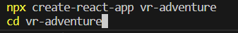
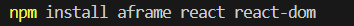
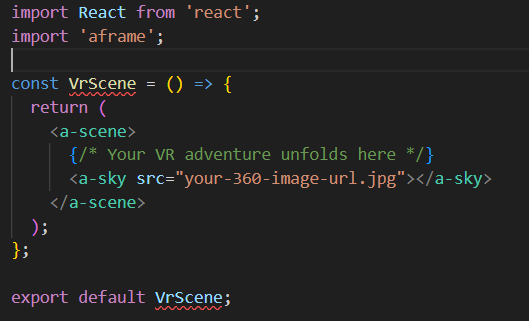
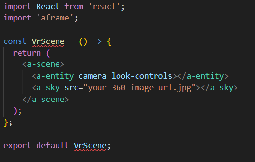
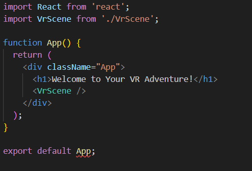
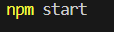

Title: Embark on a Thrilling VR Adventure with React and A-Frame

Introduction:
Are you ready to take a leap into the world of Virtual Reality? Welcome, brave traveler, to a realm where reality meets imagination! In this blog post, we invite you on an exhilarating journey as we combine the power of React, the beloved JavaScript library, with A-Frame, the enchanting VR framework. Together, we'll weave a captivating VR adventure that will leave you spellbound! So fasten your seatbelt (or rather, your VR headset!), and let's dive into the extraordinary world of virtual wonders.

Prerequisites:
No worries if you're new to the realm of React or A-Frame! A curious spirit and a dash of creativity are all you need to embark on this adventure. Before we begin, ensure you have Node.js and npm installed on your machine to set up the React project.

Step 1: Unfolding the VR Blueprint
Every grand adventure needs a sturdy foundation. Fear not, for we shall start by creating a new React project with a few simple commands:

Step 2: Equipping Your VR Arsenal
The magic of VR lies in the hands of enchanting tools. Let's equip ourselves with the necessary VR gear - A-Frame, React, and React DOM:

Step 3: Crafting Your VR Wonderland
Close your eyes and visualize the world you wish to create. Now, open them to find yourself in the src folder, where the canvas of your VR adventure awaits. Behold, the heart of our VR experience - the VrScene.js component:

j

In this enchanted realm, we use the <a-sky> tag to paint a breathtaking 360-degree image as your canvas. Replace your-360-image-url.jpg with the URL or path to your magical panorama.

Step 4: Empower Your VR Quest
To venture boldly into the VR realm, you'll need intuitive controls. Fear not! With the power of look-controls, your journey shall be seamless:

With the look-controls attribute on the <a-entity camera>, you shall wield the power to look around and explore every nook and cranny of this extraordinary world.

Step 5: Setting the VR Stage
To reveal the gateway to your VR adventure, unite the VrScene component with the main App.js:

Step 6: Unveiling the VR Magic
The stage is set, the props are in place. It's time to lift the veil of reality and unleash your VR adventure upon the world:

bash

As you cross the threshold at http://localhost:3000 in your browser, watch as the once-static realm transforms into an awe-inspiring VR experience. Immerse yourself in the magic of your creation!

Step 7: Elevating the VR Experience (Optional)
To make your VR adventure truly unforgettable, consider adding these captivating elements:

Clickable Hotspots: Scatter clickable hotspots throughout the landscape, allowing adventurers to teleport between scenes and uncover hidden wonders.

Interactive Objects: Infuse the realm with interactive 3D objects using A-Frame entities and React components. Let users wield their magic touch!

Guided Narratives: Craft an enthralling storyline, guiding users on an epic quest with captivating dialogues and immersive visual cues.

Mesmerizing Soundscapes: Enrich the atmosphere with enchanting soundscapes and melodies that take adventurers on an emotional rollercoaster!

Conclusion:
Congratulations, fearless explorer! You have successfully forged a spellbinding VR experience using React and A-Frame. With this foundation, the VR universe is yours to explore! Venture forth and whisk users away to distant realms, construct breathtaking VR tours, or craft epic VR games that will captivate the hearts of all who dare to enter.

Let your creativity be your compass, and with React as your faithful companion, the journey into the realms of Virtual Reality knows no bounds. So embrace the magic, and may your VR adventures continue to spark wonder and enchantment in all who embark upon them! Happy coding, and may your VR quest be filled with endless delight and discovery!
