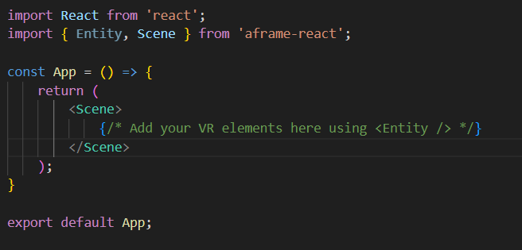

<h1>
Title: How to use React to create a virtual reality experience
</h1>

<p align="center">
<h3>
Introduction:
</h3>
<em>
Introduction:
As technology advances, Virtual Reality (VR) stands as a captivating frontier where imagination fuses with reality. Enter A-Frame, an open-source framework that leads you into the enchanting world of VR web development. In this blog post, we will delve into the dynamic synergy between A-Frame and aframe-react, exploring their essence, roles, and how they seamlessly integrate to craft awe-inspiring VR experiences.
</em>
</p>

<p align="start">
<h3>
A-Frame and React
</h3>
<em>
  A-Frame is a web framework designed for constructing virtual reality experiences. What makes it truly remarkable is its foundation on top of the DOM. This ingenious architecture allows A-Frame to harmoniously coexist with popular web libraries like React, Vue.js, Angular, Ember.js, and even d3.js. This synergy brings web development tools into the realm of VR, making it possible to craft virtual wonders using familiar tools.
</em>
</p>

<p align="start">
<h3>
Diving into A-Frame's Entity-Component-System (ECS):
</h3>
<em>
 A-Frame operates on the principles of an entity-component-system (ECS) framework, brilliantly exposed through HTML. This ECS pattern, often employed in game development, champions composability over inheritance—an ideal fit for 3D scenes characterized by complex appearance, behavior, and functionality. In A-Frame, HTML attributes transform into components, acting as building blocks that compose <a-entity> elements to add appearance, behavior, and functionality.
</em>
</p>

<p align="start">
<em>
<h3>
Introducing aframe-react: A Harmonious Partnership:
</h3>
Released alongside A-Frame, aframe-react is a subtle yet impactful layer that bridges A-Frame and React. This integration seamlessly translates React's prowess into A-Frame's VR landscape. aframe-react efficiently passes React props directly to A-Frame using refs and .setAttribute(), effectively bypassing the DOM. A-Frame's capability to accept non-string data, such as objects, arrays, or elements, ensures synchronous modifications to the underlying 3D scene graph.
</em>
</p>

<p align="start">
<em>
<h3>A-Frame's Entity-Component Meets React:</h3>
To visualize aframe-react's influence, consider the <Entity/> React Component. This element transforms into <a-entity> and promptly applies data to the 3D scene graph, bypassing the DOM. aframe-react offers a harmonious blend between A-Frame's 3D-oriented entity-component architecture and React's state management, providing the best of both worlds without compromising performance.
</em>
</p>

<p align="start">
<em>
<strong>Step 1</strong>: Prerequisites
Before diving into aframe-react, make sure you have the following installed on your system:
Node.js and npm (Node Package Manager): You'll need these to manage packages and dependencies.</em>
</p>

<!--  -->

<p align="start">
<em>
<strong>Step 2</strong>: Install aframe-react

Install aframe-react package in your project by running:
</em>

</p>

```
npm install aframe-react
```

<!--  -->

<p align="start">
<em>
<strong>Step 3</strong>: Setting Up the Scene
</br>
import the necessary components to App.jsx:
</em>
</p>

<!--  -->

```
import React from 'react';
import { Entity, Scene } from 'aframe-react';

const App = () => {
    return (
        <Scene>
            {/* Add your VR elements here using <Entity /> */}
        </Scene>
    );
}

export default App;
```

<p align="start">
<em>
<strong>Step 4</strong>: Adding Entities
Within the Scene component, you can start adding A-Frame entities using the <Entity /> component. For example, let's add a 3D box:</em>
</p>

<!--  -->

```
 <Entity geometry={{ primitive: 'box' }} position="0 1 -3" color="tomato" />

```

<!--  -->

<p align="start">
<em>
With the look-controls attribute on the <a-entity camera>, you shall wield the power to look around and explore every nook and cranny of this extraordinary world.
</em>
</p>

<!--  -->

<p align="start">
<em>
<strong>Step 5</strong>: Setting the VR Stage
To reveal the gateway to your VR adventure, unite the VrScene component with the main App.js:
</em>
</p>


<!--  -->

<p align="start">
<em>
Step 6: Unveiling the VR Magic
The stage is set, the props are in place. It's time to lift the veil of reality and unleash your VR adventure upon the world:
</em>
</p>

bash

<!--  -->

```
import React from 'react';
import { Entity, Scene } from 'aframe-react';

const App = () => {
    return (
        <Scene>
            <Entity primitive="a-sky" color="lightblue" />
            <Entity primitive="a-box" position="0 1 -3" color="tomato" />
            <Entity primitive="a-sphere" position="2 1 -5" color="yellow" />
            <Entity primitive="a-light" type="ambient" color="#888" />
            <Entity primitive="a-light" type="directional" position="-3 2 1" />
        </Scene>
    );
}

export default App;
```

<!--  -->

<p align="start">
<em>
As you cross the threshold at http://localhost:3000 in your browser, watch as the once-static realm transforms into an awe-inspiring VR experience. Immerse yourself in the magic of your creation!
</em>
</p>

<p align="start">
<em>
<strong>Conclusion:</strong>
Congratulations, fearless explorer! You have successfully forged a spellbinding VR experience using React and A-Frame. With this foundation, the VR universe is yours to explore! Venture forth and whisk users away to distant realms, construct breathtaking VR tours, or craft epic VR games that will captivate the hearts of all who dare to enter.

Let your creativity be your compass, and with React as your faithful companion, the journey into the realms of Virtual Reality knows no bounds. So embrace the magic, and may your VR adventures continue to spark wonder and enchantment in all who embark upon them! Happy coding, and may your VR quest be filled with endless delight and discovery!

</em>
</p>
